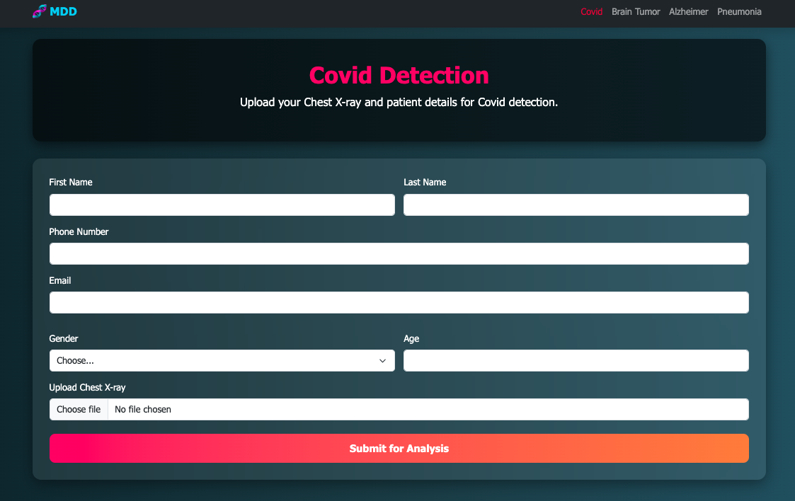

# MDD – Multi-Disease Detection Platform

A modular Flask-based web application leveraging deep learning models to detect multiple diseases.  
Currently supports predictions for:  
- **COVID-19 (Chest X-rays)**  
- **Brain Tumor (MRI scans)**  
- **Alzheimer’s Disease (MRI scans)**  
- **Pneumonia (Chest X-rays)**  

---

## 🖼️ Screenshots

### 🔹 Homepage

### 🔹 COVID-19 Detection
Upload chest X-rays for COVID-19 classification.  
  
  

### 🔹 Brain Tumor Detection
MRI scans classification for brain tumor presence.  
  
  

### 🔹 Alzheimer’s Detection
MRI classification into Alzheimer’s stages.  
  
  

### 🔹 Pneumonia Detection
X-ray classification for pneumonia.  
  
  

---

## 📊 Dataset

- The dataset was created by combining **multiple publicly available datasets** for each disease.  
- This design choice was intentional because:  
  - Larger datasets = better **generalization**.  
  - Multiple sources help reduce **biases** (scanner type, demographics, hospital-specific features).  
  - More variation = improved **robustness in real-world scenarios**.  

📌 Even though the dataset itself isn’t uploaded here (due to size/legal reasons), the methodology remains valid and reproducible.  

## ⚠️ Important Note

This repository **cannot be replicated end-to-end** because the trained deep learning models (`.h5` files) are **not included**.  

**Why?**
- Trained models are typically **hundreds of MBs each**, which exceed GitHub’s 100 MB per-file limit.  
- Hosting them here would cause issues with repo size and performance.  
- Instead, the repository focuses on the **application code, Jupyter notebooks, and UI templates**, so that others can understand the workflow and structure.  

👉 If you’d like to run the project with models, you’ll need to **train your own** (using the included notebooks) or contact the author to obtain pre-trained weights separately.  

## 🔮 Future Enhancements

* Upload pre-trained models to cloud (Google Drive / Hugging Face) with automated download script.
* Add a dataset download reference script (`download_datasets.py`).
* Containerize with Docker for consistent deployment.
* Extend to additional diseases and multi-modal input support.

---

## 📌 Conclusion

This repository is designed to demonstrate **how a multi-disease detection system can be built and deployed** with Flask + deep learning.

* The **code, templates, and structure** are all here.
* The **trained models and datasets** are intentionally excluded for practicality but can be added externally.

